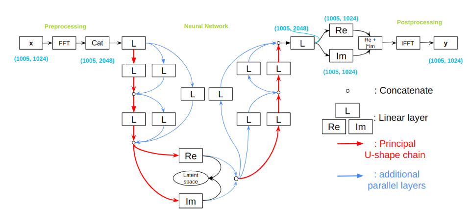

# **Project Overview**

This project focuses on developing a deep learning model to compress a turbulence velocity image efficiently while : 

- Ensuring faithful reconstruction of the compressed data.

- Respecting the physical constraints dictated by the Navier-Stokes equations.(Goy shell model)

## **Dataset**  
### Input 
The input consists of turbulence velocity images with dimensions (1005, 1024):
- 1005 represents the temporal dimension.
- 1024 represents the spatial dimension to be compressed.


### Latent Space 
The compressed turbulence velocity images have dimensions (1005, 48), reducing the spatial dimension while maintaining temporal consistency.

## **Model**  

The model is an autoencoder designed to efficiently encode and reconstruct turbulence velocity fields while preserving their physical properties. The architecture consists of:

### Encoder

The encoder starts by applying a Fourier Transform (FFT) .The real and imaginary parts of the transformed data are concatenated before being processed by a series of fully connected (linear) layers. These layers progressively reduce the spatial dimension while integrating skip connections to enhance information flow and stability during training. At the final stage of the encoder, a real-imaginary separation layer reconstructs the latent space representation .

### Latent Space

At the input of the decoder, the real and imaginary parts are concatenated before processing. The decoder then expands the latent representation back to the original spatial dimension through fully connected layers.


### Decoder
At the input of the decoder, the real and imaginary parts are concatenated before processing. The decoder then expands the latent representation back to the original spatial dimension through fully connected layers. At the end of the decoder, a layer separates the real and imaginary parts, and then the complex image is reconstructed by adding the real part and multiplying the imaginary part by i. Finally, an Inverse Fourier Transform (IFFT) is applied to reconstruct the turbulence velocity image.



## **Loss** 
To balance two key constraints : a good reconstruction and adherence to the physical constraints dictated by the Navier-Stokes equations (Goy shell model)
The loss function is defined as follows:  

```math
\mathcal{L} = (1 - \alpha) \cdot \mathcal{L}_{\text{reconstruction}} + \alpha \cdot \mathcal{L}_{\text{physical}}
```

### Physical loss

```math
\dot{u}_n = i k_n \left( 
    u_{n+1} u_{n+2} 
    \quad - \frac{\epsilon}{\lambda} u_{n-1} u_{n+1} 
    \quad + \frac{\epsilon - 1}{\lambda^2} u_{n-2} u_{n-1} 
\right)^* 
- \nu k_n^2 u_n 
+ f_n
```

#### Reconstruction loss

$$ 
MSE = \frac{1}{n} \sum_{i=1}^{n} (x_{\text{init}} - x_{\text{reconstruct}})^2 
$$

# How to use the repository ?
## 📂 Repository Structure
```markdown
.
├── 📂 doc/ # Contains all project documentation
│ └── 📄 model_architecture.png # Architecture diagram of the model
│
├── 📂 src/ # Main source code directory
│ ├── 📂 turbulence/ # Core turbulence modeling module
│ │ ├── 📄 dataset.py # Data loading and preprocessing scripts
│ │ ├── 📄 network.py # Neural network architecture definition
│ │ ├── 📄 train.py # Model training pipeline
│ │ ├── 📄 utils.py # Utility functions and helpers
│ │ └── 📂 pretrained/ # Saved model checkpoints
│ │ └── 📄 best_model.pth # Best performing model weights
│ │
│ ├── 📂 velocity_images/ # Velocity field image datasets
│ ├── 📄 notebook.ipynb # Jupyter notebook for analysis/experiments
│ └── 📄 settings.sh # Environment configuration script
│
├── 📄 .gitignore # Specifies intentionally untracked files
├── 📄 README.md # Project overview and documentation
└── 📄 requirements.txt # Python dependencies list
```


The notebook allows to perform : 
- loading data
- training the model
- loading a pretrained model
- testing a model
- plot characteristics


## File Descriptions and Functions

In the turbulence folder, there is the library with pretrained models and with the following file : 

- **dataset.py** : Create the dataset class and utility fonctions for the data processing
    - `VelocityDataset` : Class for the dataset
    - `create_data_loaders()` : Utility function that creates the train / validation / test loaders with custom percentages from a Dataset object
    - `load_data()` : Uses create_data_loaders in order to return train / validation / test loaders from a folder of .png images
    - `transform` : transform object used in the Velocity Dataset

- **network.py** : Instancie the model 
    - `Turbulence` : PyTorch Lightning Module which implements our model. The architecture is described in #TELLTHEPARTOFTHEREADME

- **train.py** : Define the training procedure
    - `save_checkpoint()` : save custom checkpoint with state_dict and the last epoch value
    - `train()` : Training procedure that takes the possibility to re-train a pretrained model and saves the model checkpoint with the custom checkpoint in the /pretrained folder.

- **utils.py** : Define utility functions
    - `plot_losses()` – Plots the training and validation loss curves over time.
    - `plot_reconstruction()` – Passes images through the model and plots original vs. reconstructed images side by side.
    - `plot_spectrums()` – Computes and plots frequency spectrums of original and reconstructed images using FFT.
    - `plot_latent_space_mode_amplitude()` – Computes and plots the real, imaginary, and absolute values of latent space modes over time.
    - `plot_flatness()` – Computes and plots the "flatness" of the latent space modes, which measures statistical properties of the latent representations.
    - `compute_flatness()` – Computes the flatness of each latent mode using statistical moments.
    - `finite_diff_time_derivative()` – Computes the time derivative of u using finite difference (forward, backward, and central differences).
    - `gledzer_physics_loss_complex()` – Computes the physics-based loss for a turbulent system using the Gledzer-Ohkitani-Yamada (GOY) shell model.
    - `combined_loss()` – Combines the MSE loss with the physics-based loss for a physics-informed learning approach.
    - `load_model()`– Loads a PyTorch model from a checkpoint file (.ckpt, .pt, or .pth).

The folder /test_images is a folder for you to load your own images

## Tutorial to use functions 
There is no configuration to perform except being in the correct Procom folder

### To Load dataset and split it in dataloaders
```python
from turbulence.dataset import load_data
train_loader, val_loader, test_loader = load_data(image_folder_path, nb_images, val_size, test_size, batch_size)`    
``` 

### To train the model from scratch
```python
train(None,train_loader, val_loader, epochs=num_epochs, pretrained=False) 
```

### To train a pretrained model 
```python
train(model_path, train_loader, val_loader, epochs=num_epochs, pretrained=True)
```

### To load pretrained model and set it to evaluation mode 
```python
# Load the trained model

from turbulence.network import Turbulence
from turbulence.utils import load_model

model = Turbulence()
trained_model_path = path # to be modified
load_model(model, trained_model_path)

model.eval()  # Set the model to evaluation mode
batch = next(iter(test_loader))
```

### PLot reconstructions for a batch of images 
```python
from turbulence.utils import plot_reconstruction

plot_reconstruction(model, batch)
```
